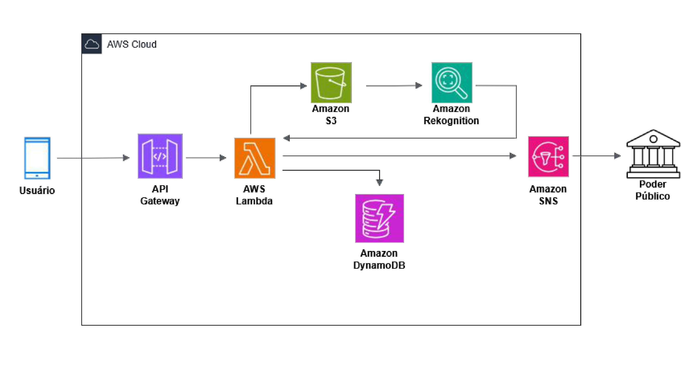

# CloudVigia ☁️🌎

Plataforma em nuvem para monitoramento urbano inteligente utilizando **AWS, Inteligência Artificial e participação cidadã**.

O projeto foi desenvolvido como **Trabalho de Conclusão do programa AWS re/Start + IA da Escola da Nuvem**, demonstrando na prática a aplicação de arquitetura cloud moderna, serverless e escalável.

---

# 📌 Sobre o Projeto

**CloudVigia** é uma plataforma web e mobile que permite que cidadãos reportem **descarte irregular de resíduos e obstruções no sistema de drenagem urbana**, ajudando prefeituras e equipes de limpeza a responder rapidamente a problemas que podem causar **alagamentos urbanos**.

A solução conecta **participação comunitária, análise inteligente de imagens e gestão pública**, criando um ecossistema de monitoramento urbano baseado em dados.

# 🎯 Problema

O descarte irregular de resíduos frequentemente causa:

- Obstrução de **bueiros e bocas de lobo**
- **Alagamentos urbanos**
- Danos a propriedades
- Prejuízos econômicos
- Ineficiência operacional das secretarias de limpeza

Além disso, muitas cidades não possuem **um canal eficiente para que cidadãos reportem esses problemas**.

---

# 💡 Solução

O **CloudVigia** resolve esse problema através de uma plataforma que permite:

1. Cidadãos registrarem denúncias com **foto e localização**
2. A plataforma analisar automaticamente as imagens
3. Armazenar e organizar os dados das ocorrências
4. Notificar responsáveis pela limpeza urbana
5. Permitir acompanhamento do status da denúncia

---

# 🚀 Funcionalidades

## Principais

- 🗺️ **Mapa interativo de ocorrências**
- 📸 **Envio de denúncias com imagem**
- 📍 **Geolocalização automática**
- 📊 **Dashboard com dados urbanos**
- 🔄 **Acompanhamento do status da denúncia**

## Técnicas

- Upload de imagens (drag & drop)
- Validação de formulários
- Visualização em mapas
- Dados simulados realistas
- Interface responsiva (mobile-first)

---

# 🧰 Tecnologias Utilizadas

## Frontend

- HTML5
- CSS3
- JavaScript (ES6+)

Bibliotecas:

- Leaflet.js — mapas interativos
- Chart.js — visualização de dados
- Font Awesome — ícones

---

# ☁️ Arquitetura em Nuvem (AWS)

A arquitetura foi projetada seguindo princípios de **serverless architecture**, priorizando:

- **Baixo custo operacional**
- **Alta escalabilidade**
- **Alta disponibilidade**
- **Baixa complexidade de infraestrutura**

O fluxo da denúncia é totalmente automatizado.

Fluxo geral da aplicação:



---

# 🔎 Explicação das Escolhas de Arquitetura

## Amazon API Gateway

O **API Gateway** atua como a porta de entrada da aplicação.

Motivos da escolha:

- Permite criar **APIs REST escaláveis**
- Integra facilmente com **AWS Lambda**
- Possui **controle de autenticação, throttling e segurança**
- Elimina necessidade de servidores dedicados

Ele recebe as denúncias enviadas pelo frontend (foto + dados).

---

## AWS Lambda

O **AWS Lambda** executa a lógica de negócio da aplicação.

Responsabilidades:

- Processar a denúncia enviada pelo usuário
- Validar os dados recebidos
- Armazenar informações no banco de dados
- Enviar imagem para análise
- Disparar notificações

Motivos da escolha:

- Arquitetura **serverless**
- **Escala automática**
- Custo baseado em execução
- Ideal para workloads baseadas em eventos

---

## Amazon S3

O **Amazon S3** é utilizado para armazenar as imagens enviadas pelos usuários.

Motivos da escolha:

- Alta durabilidade (99.999999999%)
- Armazenamento altamente escalável
- Integração nativa com serviços de IA
- Baixo custo para armazenamento de arquivos

---

## Amazon Rekognition

O **Amazon Rekognition** realiza a análise de imagens usando inteligência artificial.

Função no projeto:

- Identificar **resíduos ou objetos nas imagens**
- Auxiliar na classificação das denúncias

Motivos da escolha:

- Serviço de **IA totalmente gerenciado**
- Fácil integração com S3
- Não exige treinamento de modelos para casos simples

---

## Amazon DynamoDB

O **DynamoDB** é utilizado como banco de dados da aplicação.

Armazena:

- Dados das denúncias
- Status das ocorrências
- Informações de localização
- Metadados das imagens

Motivos da escolha:

- Banco **NoSQL altamente escalável**
- Baixa latência
- Totalmente gerenciado
- Integração nativa com Lambda

---

## Amazon SNS

O **Amazon Simple Notification Service (SNS)** é utilizado para enviar notificações.

Função:

- Notificar gestores municipais
- Informar atualizações de status da denúncia

Motivos da escolha:

- Comunicação assíncrona
- Arquitetura orientada a eventos
- Alta escalabilidade

---

# 📊 Benefícios da Arquitetura

A arquitetura proposta oferece:

### Escalabilidade

Os serviços serverless escalam automaticamente conforme o número de denúncias aumenta.

### Baixo custo

Como não há servidores dedicados, os custos são baseados no uso real.

### Alta disponibilidade

Serviços AWS garantem redundância e tolerância a falhas.

### Processamento inteligente

O uso de IA permite análise automática das imagens enviadas.

---

# ▶️ Como Executar o Projeto

1. Baixe os arquivos do projeto

2. Abra o arquivo:

```

index.html

```

3. Execute em um navegador moderno.

---

# 📚 Contexto Acadêmico

Projeto desenvolvido como **Trabalho de Conclusão do programa:**

- AWS re/Start  
- Inteligência Artificial  
- Escola da Nuvem  

O objetivo foi aplicar na prática conhecimentos de:

- Arquitetura em nuvem
- Desenvolvimento web
- Integração com serviços AWS
- Sistemas inteligentes

---

# 📄 Licença

MIT License
